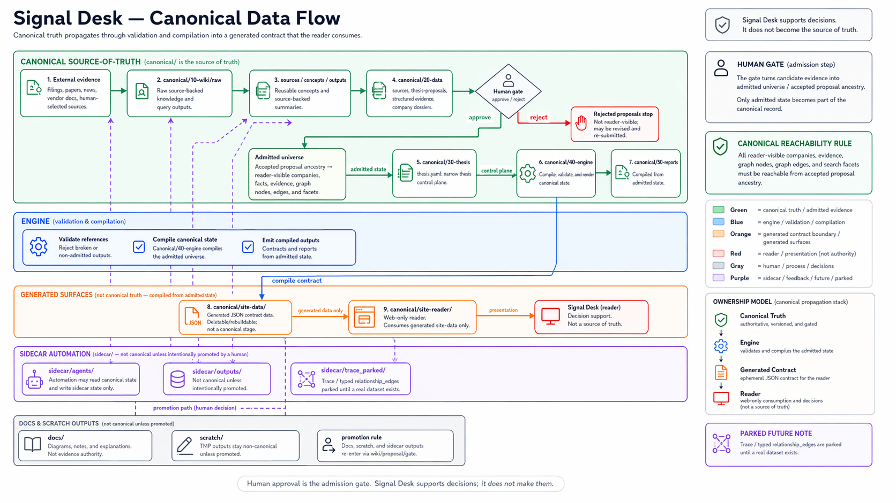
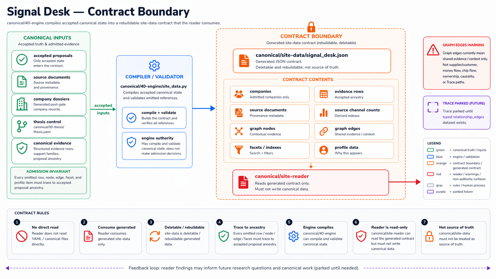
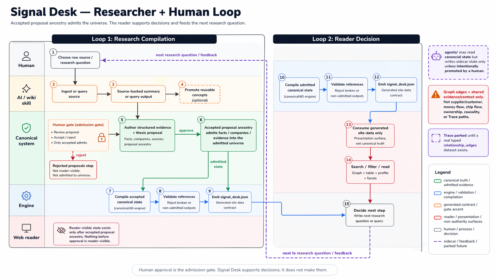
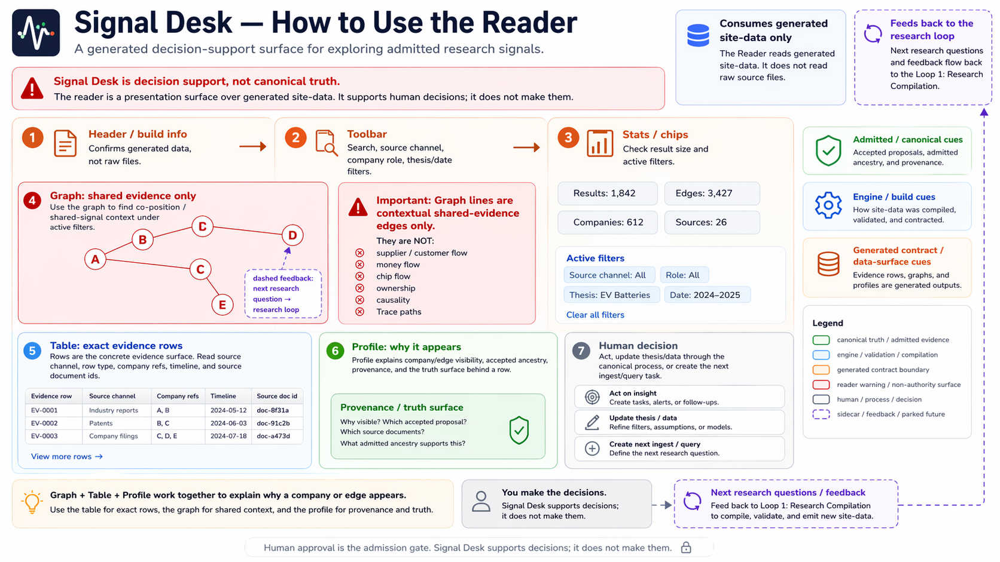

# semi-stocks-2

Second-iteration semi-stocks workspace organized as a canonical propagation system.

## Signal Desk Diagrams

### Canonical Data Flow



The active app path is repo-owned and data-contract first:

```text
canonical truth -> canonical/40-engine -> canonical/site-data -> canonical/site-reader
```

`canonical/site-data/` is generated. `canonical/site-reader/` is a web-only reader that consumes generated data and must not become a source of truth.

### Contract Boundary



`canonical/40-engine` compiles accepted canonical state into a rebuildable
`canonical/site-data/signal_desk.json` contract. The reader consumes that
generated contract only; it must not read or write canonical YAML directly.

### Researcher + Human Loop



Human loop:

```text
raw source -> wiki ingest/query -> thesis proposal -> human gate -> admitted universe -> signal_desk.json -> web reader -> next research question
```

Human approval is the admission gate. Signal Desk supports decisions; it does
not make them, and it should only show companies and evidence after accepted
proposal ancestry admits them.

### Reader Surface



Use the surface in this order:

1. **Search or filter** — narrow by ticker, phrase, source channel, company role, thesis theme, or date.
2. **Read graph shape carefully** — edges mean shared evidence only.
3. **Read table rows** — rows are the actual evidence.
4. **Open profile** — profile explains why a company or edge appears.
5. **Decide next work** — act, update thesis/data, or create the next ingest/query task.

- `Search` — use when you know a ticker, phrase, claim, source, or theme.
- `Source Channel` — provenance lens for admitted evidence: Baker, Leopold, SemiAnalysis, company earnings, and thesis stage.
- `Company Role` — economic layer: optics, memory, power, GPU cloud, foundry, chip designer, etc.
- `Filters` — thesis theme, timeline, and include-undated controls.
- `Graph controls` — reduce clutter with support-family toggles, min weight, and top-edge limits.

## Run

Generate and validate data:

```bash
uv run python canonical/40-engine/site_data.py --validate
```

Run web reader:

```bash
cd canonical/site-reader
npm install
npm run dev -- --port 5173
```

Open:

```text
http://127.0.0.1:5173/
```

Test:

```bash
uv run python canonical/40-engine/tests/test_signal_desk_contract.py
cd canonical/site-reader
npm test
npm run build
npm run test:e2e
```

## Parked

- Trace is parked until a typed `relationship_edges` dataset exists.
- Graph edges are contextual evidence only.
- No supplier/customer, money-flow, chip-flow, ownership, causality, or Trace path should be inferred from graph lines.

Start here:
- Read [docs/architecture.md](docs/architecture.md) for lane ownership and propagation order.
- Read [docs/doc-contract.md](docs/doc-contract.md) for root-doc and subsystem-doc boundaries.
- Read [docs/ash.md](docs/ash.md) for a visual explainer of the repository.
- Use [AGENTS.md](AGENTS.md) or [CLAUDE.md](CLAUDE.md) for agent routing.

## Top-Level Map

- `canonical/` — source-of-truth propagation lanes
- `agents/` — sidecar automation, drafts, logs, and scheduler state
- `docs/` — durable repo docs and process docs
- `tmp/` — scratch space
- `config.yaml` — shared runtime config kept at root during migration
- `pyproject.toml` / `uv.lock` — Python runtime managed with `uv`

## Canonical Stages

- `canonical/10-wiki/` — canonical knowledge workspace and ingest landing zone
- `canonical/20-data/` — structured evidence, proposal decisions, and generated post-gate company dossiers (`sources/`, `thesis-proposals/`, `companies/`)
- `canonical/30-thesis/thesis.yaml` — narrow control plane
- `canonical/40-engine/` — engine stage wrapper and package-safe Python module root
- `canonical/50-reports/` — canonical published artifacts

## Generated App Surfaces

- `canonical/site-data/` — generated JSON contract for repo-owned web readers and review surfaces; not a canonical stage
- `canonical/site-reader/` — repo-owned web reader source that consumes `canonical/site-data/`; not a canonical stage

Use `uv run ...` for Python commands. Wiki ingest, query, and lint work should route through the repo-local `ingest-semi` skill rather than generic wiki discovery.
