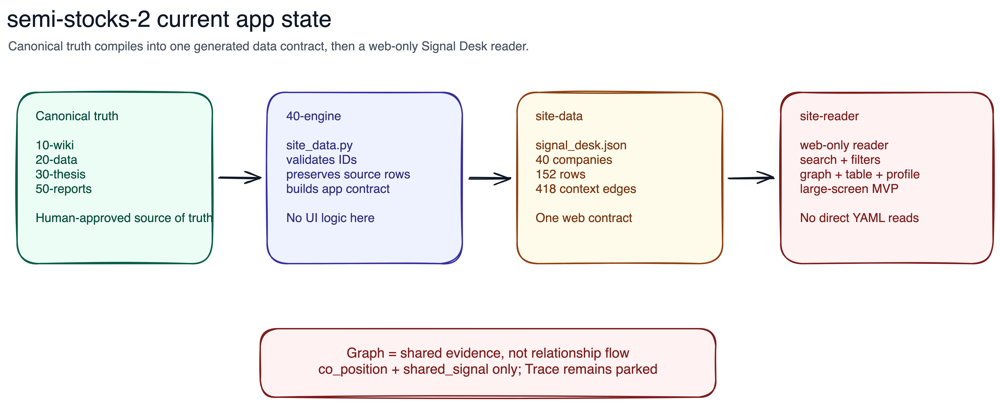

# semi-stocks-2

Second-iteration semi-stocks workspace organized as a canonical propagation system.

## Current State



The active app path is repo-owned and data-contract first:

```text
canonical truth -> canonical/40-engine -> canonical/site-data -> canonical/site-reader
```

`canonical/site-data/` is generated. `canonical/site-reader/` is a web-only reader that consumes generated data and must not become a source of truth.

Start here:
- Read [docs/architecture.md](docs/architecture.md) for lane ownership and propagation order.
- Read [docs/doc-contract.md](docs/doc-contract.md) for root-doc and subsystem-doc boundaries.
- Read [docs/ash.md](docs/ash.md) for a visual explainer of the repository.
- Use [AGENTS.md](AGENTS.md) or [CLAUDE.md](CLAUDE.md) for agent routing.

## Top-Level Map

- `canonical/` — source-of-truth propagation lanes
- `agents/` — sidecar automation, drafts, logs, and scheduler state
- `docs/` — durable repo docs and process docs
- `tmp/` — scratch space
- `config.yaml` — shared runtime config kept at root during migration
- `pyproject.toml` / `uv.lock` — Python runtime managed with `uv`

## Canonical Stages

- `canonical/10-wiki/` — canonical knowledge workspace and ingest landing zone
- `canonical/20-data/` — structured evidence only (`sources/`, `companies/`)
- `canonical/30-thesis/thesis.yaml` — narrow control plane
- `canonical/40-engine/` — engine stage wrapper and package-safe Python module root
- `canonical/50-reports/` — canonical published artifacts

## Generated App Surfaces

- `canonical/site-data/` — generated JSON contract for repo-owned web readers and review surfaces; not a canonical stage
- `canonical/site-reader/` — repo-owned web reader source that consumes `canonical/site-data/`; not a canonical stage

Use `uv run ...` for Python commands. Wiki ingest, query, and lint work should route through the repo-local `ingest-semi` skill rather than generic wiki discovery.
