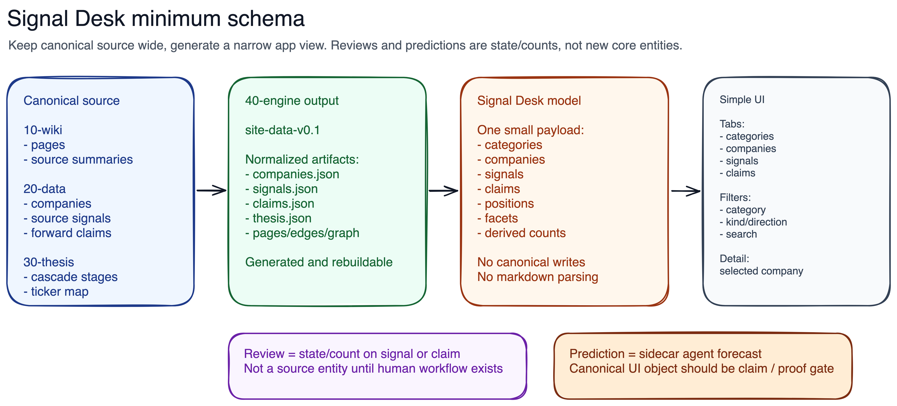

# Design: Signal Desk Schema

## Visual



## Relevant Principles

- Keep the canonical pipeline unchanged: `10-wiki -> 20-data -> 30-thesis -> 40-engine -> 50-reports`.
- Treat `canonical/site-data/` as generated app data, not a new canonical stage.
- Keep the first UI small: category scan, company detail, signal list, claim/proof-gate list.
- Preserve traceability from every app row back to source page/path/ref.

## Minimum App Vocabulary

| UI word | Schema word | Meaning |
|---|---|---|
| Category | `category` / thesis stage | Wide-to-narrow thesis bucket, derived from `30-thesis.cascade` |
| Company | `company` | Ticker-level exposure and evidence target |
| Signal | `signal` | Evidence observation that supports, contradicts, proposes, or updates a thesis/category/company |
| Claim | `claim` / proof gate | Forward-looking verifiable statement with status and verify window |
| Position | `position` | Fund/source exposure attached to a company |
| Review | `review_state` or derived count | UI workflow state, not source entity yet |
| Prediction | `agent_prediction` only if imported | Sidecar pre-earnings forecast, not same as canonical claim |

## Decisions

### D1 - Keep Signal Desk as a generated app view model

**Decision:** Add a small `signal_desk` view model only after approval, generated from existing `site-data` artifacts.

**Rationale:** The UI should not join 12 JSON files or read canonical markdown/YAML. But the view model must remain downstream and rebuildable.

**Affected areas:** Future `canonical/40-engine/engine/site_data.py`, `canonical/site-data/signal_desk.json`.

### D2 - Make category the top-level UI object

**Decision:** Category means thesis stage. It should normalize stage display names and bottleneck slugs into one record:

```yaml
id: category:n3-logic
label: N3 logic wafers
slug: n3_logic
status: active
period: 2025-2027
company_ids: [...]
signal_ids: [...]
claim_ids: [...]
counts: {companies, signals, claims}
```

**Rationale:** Current data splits category identity across stage names, `ticker_map.bottleneck`, signal `bottleneck`, and legacy source labels like `optical`. The UI needs one join key.

### D3 - Keep companies mostly as they are

**Decision:** Company rows should remain first-class, with a smaller UI projection:

```yaml
id, ticker, name, category_id, status, also_category_ids,
positions, metrics, thesis_summary, source_page,
signal_ids, claim_ids, counts
```

**Rationale:** Current `companies.json` already has the right core. It is richer than the first UI needs, so the desk view model should project it instead of expanding the UI.

### D4 - Signal is the evidence row

**Decision:** Use `signal` for evidence rows across company, SemiAnalysis, thesis-stage, and proposal signals. Normalize the UI fields:

```yaml
id, kind, category_id, company_ids, direction, evidence,
source_page, source_path, source_ref, review_state
```

**Rationale:** This covers source-backed evidence without duplicating wiki pages. `review_state` can be derived as `reviewed` for emitted canonical/company/stage signals and `pending` for proposal signals.

### D5 - Rename UI predictions to claims/proof gates

**Decision:** The UI should call canonical forward-looking rows `claims` or `proof gates`, not `predictions`.

**Rationale:** `agents/state/predictions` is a real sidecar schema with 26 current forecast rows and scoring lifecycle. The screenshot count does not match that. Calling canonical claims "predictions" will create schema confusion.

### D6 - Do not create a Review entity yet

**Decision:** `review` should not be a top-level table. Use `review_state` on `signal` and `claim` only when needed.

**Rationale:** No code or source data stores review objects. Screenshot `reviews` is explainable as a derived count over non-proposal signals. A separate entity would be fake schema.

### D7 - UI consumes one simple desk payload

**Decision:** Keep normalized source artifacts, but give the UI a single desk payload:

```yaml
version: signal-desk-v0.1
source_build: site-data-v0.1
summary_counts:
  categories: 10
  companies: 40
  signals: 67
  reviewed_signals: 64
  claims: 43
  pending_proposals: 3
categories: [...]
companies: [...]
signals: [...]
claims: [...]
facets:
  statuses: [...]
  directions: [...]
  signal_kinds: [...]
```

**Rationale:** This keeps the UI simple now and lets richer pages use normalized `pages`, `graph`, and `edges` later.

## Minimum Relationship Model

```
category <- company
category <- signal
company  <- signal
company  <- claim
company  <- position
signal   -> source_page/source_path/source_ref
claim    -> source_page/source_path/source_ref
```

Everything else can stay in `edges.json` until the UI needs it.

## What To Show Now

- Cards: `categories`, `companies`, `signals`, `claims/proof gates`.
- Drop or relabel: `reviews` -> `reviewed signals` only if needed.
- Drop or relabel: `predictions` -> `claims` unless agent predictions are imported.
- Left table: categories with status, period, companies, signals, claims, tickers.
- Right panel: selected company with exposure, positions, signals, claims, and source link.

## Parked

- Agent prediction import from `agents/state/predictions`.
- Human review workflow and review history.
- Scorecards/backtests in the main UI.
- Graph/map exploration.
- Full wiki page rendering.
- Claim promotion into thesis proposals.
