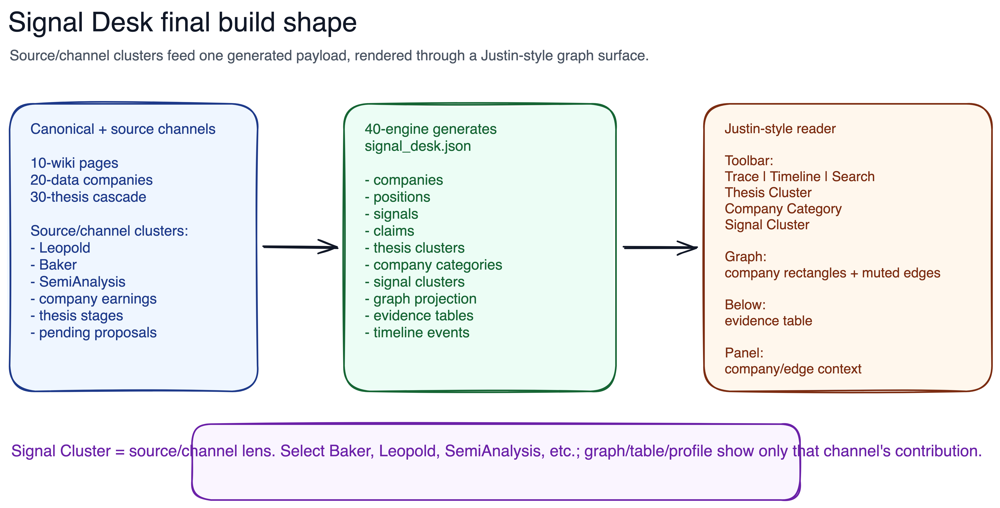

# Final Spec: Signal Desk Justin-Style Reader

> Superseded for implementation by [14_final_spec_v0_2.md](14_final_spec_v0_2.md).
> This file remains as historical context for the pre-Research-Pro final spec.

## Visual



## 0. Plan Review Findings

The current plan had issues after Ash clarified the intended meaning of
`Signal Cluster`.

### Issue 1 - Signal Cluster was too topic-oriented

Earlier drafts treated `Signal Cluster` as automatic topic clustering over
signal text, such as "Rubin capacity" or "HBM pricing." That is useful later,
but it is not the primary interaction Ash described.

**Correction:** `Signal Cluster` is now a source/channel filter:

- Leopold
- Baker
- SemiAnalysis
- company earnings
- thesis stage
- pending proposals
- later daily agent signals

Topic clustering becomes a subordinate future feature inside or across source
channels.

### Issue 2 - `signals.json` alone cannot power source-channel clusters

Current `canonical/site-data/signals.json` contains:

- 25 `company_thesis_signal`
- 6 `semianalysis_signal`
- 33 `thesis_stage_signal`
- 3 `thesis_proposal_signal`

It does not contain Leopold/Baker as signal rows. Leopold and Baker live mostly
as fund positions inside `canonical/20-data/sources/<fund>/q4_2025.yaml` and
as embedded `company.positions` in `companies.json`.

**Correction:** `signal_desk.json` must include `positions` as first-class UI
rows, and source/channel clusters must be allowed to contain `position_ids`,
`signal_ids`, `claim_ids`, and later `agent_prediction_ids`.

### Issue 3 - Source metadata is inconsistent

Some current signal rows have `source`, some only have `source_path`, and fund
positions are embedded under companies.

**Correction:** The Signal Desk view model will normalize every row into:

- `source_cluster_id`
- `source_kind`
- `source_label`
- `source_paths`
- `source_refs`

Canonical source files remain unchanged.

### Issue 4 - Trace would be misleading if enabled first

Justin's Trace is clean because his data is a directed deal graph with explicit
source-target relationships and a value-chain rank. Semi-stocks currently has
evidence/provenance edges, not a supplier-customer deal graph.

**Correction:** Trace appears in the UI contract but ships disabled until the
graph projection has value-chain-safe edges and company category ranks.

## 1. Product Target

Build a Signal Desk reader that looks and behaves like Justin Wang's
`compute.jstwng.com`, but uses semi-stocks canonical data.

The reader is not a generic dashboard. It is a dense graph-first evidence
surface:

- top controls narrow the evidence surface
- graph shows company relationships and clusters
- table below shows the underlying evidence rows
- profile panel explains selected company or relationship

The first implementation is schema/data first. UI follows after
`signal_desk.json` exists and validates.

## 2. Visual Target

The reader should closely match Justin's visual system:

- Inter font
- 12px desktop base density
- dark-mode-first feel
- exact CSS variable palette from Justin where practical
- square rectangular controls and nodes
- thin muted borders
- no rounded cards
- no colorful graph taxonomy
- compact header
- top toolbar with dropdown chips and search
- large graph block
- dense evidence table below
- slide-in profile panel on desktop
- bottom-sheet profile/filter panels on mobile

Justin source:

- UI repo: `https://github.com/jstwng/compute-site`
- inspected commit: `1f90a873c44ceea03240ccb5658e115dbc40e6c6`
- license metadata: MIT in `package.json`

If substantial CSS/components are copied, add attribution under the reader
source tree.

## 3. Ownership And Boundaries

### Repo boundaries

- Canonical source stays in:
  - `canonical/10-wiki/`
  - `canonical/20-data/`
  - `canonical/30-thesis/`
  - `canonical/50-reports/`
- Generator ownership stays in:
  - `canonical/40-engine/`
- Generated app data goes to:
  - `canonical/site-data/`
- New reader source should go to:
  - `canonical/site-reader/`
- Built static reader output should go to:
  - `canonical/site/` or another explicitly generated output directory, after
    implementation starts.

`canonical/site-reader/` and `canonical/site-data/` are not new canonical
propagation stages. They are reader source and generated integration data.

### No direct UI reads from canonical source

The UI must consume `canonical/site-data/signal_desk.json` only for the first
slice. It must not parse canonical markdown/YAML directly.

## 4. Final Toolbar Model

Desktop toolbar:

```text
Trace | Timeline | Thesis Cluster | Company Category | Signal Cluster | Search
```

Mobile toolbar:

- first row: search
- second row: compact chips for each control
- dropdown content opens in bottom sheets, copying Justin's pattern

Only one dropdown panel opens at a time. Active filter state remains
independent and composable.

### Control state

```yaml
controls:
  search: ""
  trace:
    enabled: false
    origin_company_id: null
    destination_company_id: null
    path_index: 0
    hop_count: null
  timeline:
    from: null
    to: null
    mode: evidence_date
  thesis_cluster:
    selected_ids: []
  company_category:
    selected_ids: []
  signal_cluster:
    selected_ids: []
```

### Multi-select semantics

Within one control, selections use union semantics:

- Selecting Baker + Leopold shows rows touched by either source.
- Deselecting Baker removes Baker rows and Baker-only highlights.
- Companies remain visible if still touched by Leopold or another selected
  source.

Across controls, filters compose by intersection:

- `Signal Cluster = Baker`
- `Company Category = optics`
- result: Baker-touched companies/rows that are also optics companies.

No selection means "all" for that control.

## 5. Control Details

### 5.1 Search

Purpose: global narrowing.

Fields searched:

- company ticker
- company name
- company category label
- thesis summary
- signal evidence
- claim text
- position source/fund/ticker notes
- source/page title and summary

UI:

- desktop: right side of toolbar
- mobile: first full row
- placeholder: `Search companies, signals, claims`

Implementation:

- add `search_text` to company, signal, claim, position, source table rows in
  `signal_desk.json`
- lowercase matching in UI for first slice

### 5.2 Timeline

Purpose: show evidence active in a date range.

Initial mode:

- year range, same as Justin

Future modes:

- month
- quarter
- upcoming proof gates

Normalized fields:

```yaml
timeline:
  date: "2026-04-02"
  precision: day|month|quarter|year|label
  label: "Apr 2026"
  kind: source_date|earnings_date|filing_date|verify_at|thesis_updated
```

Rows without parseable dates:

- keep `timeline.label`
- leave `timeline.date` null
- table can show them, but timeline filter excludes them unless "Include
  undated" is later added

Graph behavior:

- active companies/edges remain full opacity
- inactive companies/edges dim

Table behavior:

- filter to rows with timeline date inside range

### 5.3 Thesis Cluster

Purpose: Ash's thesis map.

Initial records come from:

- `canonical/30-thesis/thesis.yaml` cascade stages
- notebook buckets as parent/parallel labels:
  - Energy
  - Chips
  - Infrastructure
  - Models
  - Applications

Schema:

```yaml
thesis_clusters:
  - id: thesis-cluster:n3-logic
    label: N3 logic wafers
    slug: n3_logic
    parent_bucket: Chips
    status: active
    period: 2025-2027
    cycle_phase: mid_shortage
    company_ids: [...]
    signal_ids: [...]
    claim_ids: [...]
    position_ids: [...]
    counts:
      companies: 4
      signals: 18
      claims: 18
      positions: 6
```

UI:

- multi-select checklist
- selecting one highlights related companies and evidence
- table filters to evidence tied to selected thesis cluster

### 5.4 Company Category

Purpose: economic role / value-chain position.

This mirrors Justin's `company.category` but with semi-stocks names.

Initial categories:

```yaml
company_categories:
  - id: company-category:equipment
    label: Equipment
    rank: 0
  - id: company-category:foundry
    label: Foundry
    rank: 1
  - id: company-category:memory
    label: Memory
    rank: 1
  - id: company-category:chip-designer
    label: Chip designers
    rank: 2
  - id: company-category:networking
    label: Networking
    rank: 3
  - id: company-category:optics
    label: Optics
    rank: 3
  - id: company-category:power
    label: Power
    rank: 3
  - id: company-category:gpu-cloud
    label: GPU cloud
    rank: 4
  - id: company-category:hyperscaler-ai-lab
    label: Hyperscalers / AI labs
    rank: 5
  - id: company-category:investor
    label: Investors
    rank: null
```

Category derivation:

- prefer explicit mapping table in generator
- fallback from `company.bottleneck`
- fallback from ticker/source heuristics only if documented

Examples:

- `NVDA` -> `chip-designer`
- `TSM` -> `foundry`
- `MU` -> `memory`
- `COHR`, `LITE`, `CIEN` -> `optics`
- `CRWV`, `NBIS` -> `gpu-cloud`
- `BE`, `CORZ`, `EQT`, `IREN` -> `power`
- `ASML`, `AMAT`, `KLAC`, `LRCX` -> `equipment`

UI:

- multi-select checklist
- drives graph centroid/layout
- filters table to rows tied to selected company categories

### 5.5 Signal Cluster

Purpose: source/channel clustered surfacing.

This is the corrected meaning.

Initial signal clusters:

```yaml
signal_clusters:
  - id: signal-cluster:leopold
    label: Leopold
    cluster_type: source_channel
    source_kind: fund_positioning
    aliases: [situational-awareness, situational awareness]
    source_paths:
      - canonical/20-data/sources/leopold/q4_2025.yaml
      - canonical/10-wiki/sources/leopold-q4-2025.md
    position_ids: [...]
    signal_ids: []
    claim_ids: []
    company_ids: [...]
    summary: "Leopold/Situational Awareness positioning and thesis read-through."

  - id: signal-cluster:baker
    label: Baker
    cluster_type: source_channel
    source_kind: fund_positioning
    aliases: [atreides, gavin-baker]
    source_paths:
      - canonical/20-data/sources/baker/q4_2025.yaml
      - canonical/10-wiki/sources/baker-q4-2025.md
    position_ids: [...]
    company_ids: [...]

  - id: signal-cluster:semianalysis
    label: SemiAnalysis
    cluster_type: source_channel
    source_kind: supply_chain_research
    aliases: [sem, semi-analysis, sa, dylan-patel]
    source_paths:
      - canonical/20-data/sources/semianalysis/signals.yaml
      - canonical/10-wiki/sources/semianalysis-signals.md
    signal_ids: [...]
    company_ids: [...]

  - id: signal-cluster:company-earnings
    label: Company earnings
    cluster_type: source_channel
    source_kind: company_reported
    signal_ids: [...]
    claim_ids: [...]
    company_ids: [...]

  - id: signal-cluster:thesis-stage
    label: Thesis stage
    cluster_type: source_channel
    source_kind: thesis_control
    signal_ids: [...]
    company_ids: [...]

  - id: signal-cluster:pending-proposals
    label: Pending proposals
    cluster_type: source_channel
    source_kind: thesis_proposal
    signal_ids: [...]
    claim_ids: []
    company_ids: [...]
```

UI:

- multi-select checklist
- selecting `Leopold` highlights all companies with Leopold positions
- selecting `SemiAnalysis` highlights companies in SemiAnalysis signal rows
- selecting `Baker` highlights Baker companies
- selecting multiple shows union
- deselecting one removes that source's contribution
- table switches to the rows relevant to selected source clusters
- profile panel explains why each selected source touches a selected company

Below-graph context:

- for fund clusters: show position rows and source summary
- for SemiAnalysis: show supply-chain signal rows
- for company earnings: show company thesis signals and claims
- for pending proposals: show proposal signal rows

Future subordinate topic clusters:

```yaml
topic_clusters:
  - id: topic-cluster:rubin-capacity
    parent_signal_cluster_ids:
      - signal-cluster:semianalysis
      - signal-cluster:company-earnings
    method: lexical-v0
    terms: [rubin, capacity, n3, commitments]
```

Do not ship topic clusters in first slice.

### 5.6 Trace

Purpose: company-to-company value-chain path.

Status: visible but disabled until graph projection is safe, or hidden behind
feature flag.

Trace rank:

```yaml
0: equipment
1: foundry | memory | packaging | materials
2: chip_designer
3: server_oem | networking | optics | power
4: gpu_cloud | data_center | hyperscaler
5: ai_lab | application
```

Rules copied from Justin:

- downstream-only traversal
- cap max depth
- cap max path count
- group paths by category shape
- hop-count chips
- selected path highlights graph and filters table
- swap button when no path exists in chosen direction

Do not use generic evidence edges for Trace.

## 6. `signal_desk.json` Contract

Add a new generated artifact:

`canonical/site-data/signal_desk.json`

Top-level shape:

```yaml
version: signal-desk-v0.1
source_build:
  generator: site-data-v0.1
  source_hash: ...
  generated_at: ...
summary_counts:
  companies: 40
  thesis_clusters: 7
  company_categories: 10
  signal_clusters: 6
  signals: 67
  claims: 43
  positions: 58
controls:
  search: true
  timeline: true
  thesis_cluster: true
  company_category: true
  signal_cluster: true
  trace:
    enabled: false
thesis_clusters: [...]
company_categories: [...]
signal_clusters: [...]
companies: [...]
positions: [...]
signals: [...]
claims: [...]
timeline_events: [...]
graph:
  nodes: [...]
  edges: [...]
tables:
  default: signals
  signals: [...]
  claims: [...]
  positions: [...]
  sources: [...]
facets:
  directions: [...]
  statuses: [...]
  source_kinds: [...]
  table_kinds: [...]
```

## 7. Row Models

### Company row

```yaml
id: company:NVDA
ticker: NVDA
name: NVIDIA Corporation
company_category_id: company-category:chip-designer
thesis_cluster_ids:
  - thesis-cluster:n3-logic
signal_cluster_ids:
  - signal-cluster:baker
  - signal-cluster:company-earnings
  - signal-cluster:semianalysis
status: active
also_cluster_ids: [...]
source_page: nvda-q4-fy2026
metrics:
  revenue_label: Revenue
  revenue_value: 68127000000
positions_summary:
  total_value: 1012000000
  sources: [baker]
counts:
  signals: 7
  claims: 7
  positions: 1
search_text: "nvda nvidia corporation n3 logic baker semianalysis..."
```

### Position row

```yaml
id: position:baker:NVDA:q4-2025:01
source_cluster_id: signal-cluster:baker
source_kind: fund_positioning
company_id: company:NVDA
ticker: NVDA
fund: baker
quarter: Q4 2025
period: 2025-12-31
filed: 2026-02-17
position_type: call
value: 653000000
pct_portfolio: 0.08
change_vs_prior: new
bottleneck: n3_logic
thesis_cluster_ids:
  - thesis-cluster:n3-logic
notes: ""
source_path: canonical/20-data/sources/baker/q4_2025.yaml
timeline:
  date: 2026-02-17
  precision: day
  label: Filed Feb 17 2026
```

### Signal row

```yaml
id: signal:semianalysis:2026-04-02:01
source_cluster_id: signal-cluster:semianalysis
source_kind: supply_chain_research
company_ids:
  - company:NVDA
  - company:CRWV
  - company:TSM
thesis_cluster_ids:
  - thesis-cluster:n3-logic
kind: semianalysis_signal
direction: signal
title: The Great GPU Shortage — Rental Capacity
evidence: "H100 1yr rental..."
source_path: canonical/20-data/sources/semianalysis/signals.yaml
timeline:
  date: 2026-04-02
  precision: day
  label: Apr 2 2026
```

### Claim row

```yaml
id: claim:NVDA:q4-fy2026:01
source_cluster_id: signal-cluster:company-earnings
source_kind: company_reported
company_id: company:NVDA
thesis_cluster_ids:
  - thesis-cluster:n3-logic
claim: Q1 FY2027 revenue of $78B +/-2%
status: pending
verify_at: Q1 FY2027 earnings (~May 2026)
timeline:
  date: 2026-05-28
  precision: day
  label: verify at Q1 FY2027 earnings
source_page: nvda-q4-fy2026
source_path: canonical/20-data/companies/NVDA/q4_fy2026.yaml
```

## 8. Graph Projection

The graph uses company nodes only in the first slice, matching Justin's
company-node look.

### Nodes

```yaml
nodes:
  - id: company:NVDA
    label: NVIDIA Corporation
    ticker: NVDA
    company_category_id: company-category:chip-designer
    thesis_cluster_ids: [...]
    signal_cluster_ids: [...]
    val: 8
```

### Edges

Do not dump all `edges.json`. Build legible projection edges:

1. Fund co-position edges:
   - companies held by same fund
   - edge source cluster: Leopold or Baker
   - weight by combined position size or count
2. SemiAnalysis co-signal edges:
   - companies mentioned in same SemiAnalysis signal
   - weight by shared signal count
3. Thesis co-cluster edges:
   - companies in same thesis cluster
   - lower default weight
4. Company-earnings read-through edges:
   - company signal points to another company/category only if encoded
   - otherwise do not infer

Edge row:

```yaml
edges:
  - id: graph-edge:semianalysis:NVDA:TSM
    source: company:NVDA
    target: company:TSM
    edge_type: shared_signal_cluster
    source_cluster_id: signal-cluster:semianalysis
    evidence_ids:
      - signal:semianalysis:2026-03-15:02
    weight: 2
```

Rendering:

- use thin muted line
- aggregate multiple evidence rows per pair
- click edge opens evidence panel
- hover dims unrelated nodes and edges

## 9. UI Implementation Plan

### Source tree

Create:

```text
canonical/site-reader/
  package.json
  index.html
  src/
    main.jsx
    App.jsx
    styles.css
    app.css
    components/SignalDesk/
      Toolbar.jsx
      Dropdown.jsx
      MobileFilterSheet.jsx
      Graph.jsx
      EvidenceTable.jsx
      ProfilePanel.jsx
      HoverCard.jsx
      logic.js
      data.js
      useMediaQuery.js
      styles.module.css
  THIRD_PARTY_NOTICES.md
```

Copy/adapt from Justin:

- `Toolbar.jsx`
- `Dropdown.jsx`
- `MobileFilterSheet.jsx`
- `Graph.jsx`
- `ProfilePanel.jsx`
- global theme CSS
- graph/table/profile CSS patterns

Do not keep Justin domain-specific names like `Deal`, `Transaction`, or
`ComputeDealMap` in new semi-stocks components.

### Dependencies

Use same stack:

```json
{
  "dependencies": {
    "@fontsource/inter": "^5.2.8",
    "d3": "^7.9.0",
    "react": "^18.3.1",
    "react-dom": "^18.3.1"
  },
  "devDependencies": {
    "@vitejs/plugin-react": "^4.7.0",
    "vite": "^5.4.21",
    "vitest": "^4.1.4"
  }
}
```

### Data loading

First slice can load:

```js
fetch('../site-data/signal_desk.json')
```

or bundle JSON at build time. Runtime fetch is simpler while local iteration
continues.

### Toolbar implementation

Use Justin's dropdown mechanics:

- one open dropdown at a time
- independent active filter state
- double-rAF open animation
- mobile bottom sheet
- compact button labels

Desktop display values:

- `Trace: Off`
- `Timeline: All years`
- `Thesis Cluster: All`
- `Company Category: All`
- `Signal Cluster: All`

### Graph implementation

Use Justin's graph mechanics:

- d3 force simulation
- dynamic node width
- overlap removal
- ResizeObserver debounce
- layout cache
- opacity transitions
- selected/focused neighborhood
- edge clipping at node border
- click empty graph to reset focus

Difference:

- node placement should bias toward `company_category.rank` centroids once
  enough categories exist
- trace disabled initially

### Table implementation

Rename Justin's `DealTable` concept to `EvidenceTable`.

Table modes:

- Signals
- Claims
- Positions
- Sources

Default mode:

- if selected signal cluster is fund-based, use Positions
- if selected signal cluster is SemiAnalysis, use Signals
- if selected thesis/company cluster, use Signals
- otherwise use Signals

### Profile panel

Company profile:

- name/ticker
- company category
- thesis clusters
- selected signal-cluster context
- positions by source
- signals by source
- claims/proof gates
- source links

Edge profile:

- source company
- target company
- relationship type
- selected source clusters contributing to edge
- evidence rows behind edge

## 10. Generator Implementation Plan

Modify:

- `canonical/40-engine/engine/site_data.py`
- `canonical/40-engine/site_data.py` only if command output text changes

### Add artifact name

In `build_site_data()`, include `signal_desk` in written artifacts.

### Add collection

In `_collect_artifacts()`:

```python
positions = _build_positions(companies, thesis)
signal_desk = _build_signal_desk(
    pages=page_index["pages"],
    companies=companies,
    signals=signals,
    claims=claims,
    thesis=thesis_payload,
    reports=reports,
    positions=positions,
)
```

### New helper functions

- `_build_positions(companies, thesis_payload) -> list[dict]`
- `_build_thesis_clusters(thesis_payload, companies, signals, claims, positions)`
- `_build_company_categories(companies)`
- `_company_category_for(company) -> str`
- `_build_signal_clusters(signals, claims, positions, thesis_payload)`
- `_signal_cluster_for_signal(signal) -> str`
- `_build_signal_desk_graph(companies, signals, claims, positions, clusters)`
- `_build_signal_desk_tables(...)`
- `_timeline_for_row(row) -> dict`
- `_search_text(*values) -> str`

### Validation additions

`validate_site_data()` should verify:

- `signal_desk` exists
- every `company_id` referenced exists
- every `signal_id` referenced exists
- every `claim_id` referenced exists
- every `position_id` referenced exists
- every graph edge endpoint exists
- every selected cluster ID exists

### Schema additions

`schema.json` should list:

- `signal_desk.json`
- required fields for:
  - thesis cluster
  - company category
  - signal cluster
  - position
  - graph node
  - graph edge

## 11. Verification Commands

Data generation:

```bash
uv run python canonical/40-engine/site_data.py --validate
python3 -m json.tool canonical/site-data/signal_desk.json >/dev/null
```

Reader:

```bash
cd canonical/site-reader
npm install
npm run build
npm run test
```

Manual smoke:

- search `NVDA`
- select `Signal Cluster: Baker`
- select `Signal Cluster: Leopold`
- select `Signal Cluster: SemiAnalysis`
- select `Company Category: Optics`
- select `Thesis Cluster: N3 logic wafers`
- click company node
- click graph edge
- verify table rows match selected filters
- verify dark mode matches Justin

## 12. Acceptance Criteria

### Data

- `signal_desk.json` is generated from canonical and sidecar-readable source
  data.
- No UI code reads canonical markdown/YAML directly.
- Source clusters include Baker, Leopold, SemiAnalysis, company earnings,
  thesis stage, pending proposals.
- Baker/Leopold source clusters include position rows.
- SemiAnalysis source cluster includes SemiAnalysis signal rows.
- Company earnings source cluster includes company thesis signals and claims.
- Every displayed row has source trace.

### UI

- Theme closely matches Justin's site.
- Toolbar visually matches Justin's density and interaction pattern.
- Graph nodes are company rectangles with ticker secondary text.
- Graph hover/focus behavior dims unrelated nodes/edges.
- Selecting/deselecting signal clusters changes graph/table/profile context.
- Evidence table replaces transaction table but keeps same dense feel.
- Profile panel explains selected company/edge context.

### Non-goals for first slice

- Do not enable Trace unless rank-safe graph projection is ready.
- Do not add embeddings.
- Do not import agent predictions.
- Do not build full wiki page rendering.
- Do not create a human review workflow.

## 13. Implementation Order

### Phase 1 - Data contract

1. Add `positions` row builder inside `signal_desk.json`.
2. Add thesis clusters.
3. Add company categories.
4. Add source/channel signal clusters.
5. Add table projections.
6. Add graph projection.
7. Validate.

### Phase 2 - Reader shell

1. Scaffold Vite/React reader in `canonical/site-reader/`.
2. Copy Justin theme and controls with attribution.
3. Adapt data loader to `signal_desk.json`.
4. Render graph.
5. Render table.
6. Render profile panel.

### Phase 3 - Filter behavior

1. Search.
2. Timeline.
3. Thesis Cluster.
4. Company Category.
5. Signal Cluster.
6. Edge/company click panels.

### Phase 4 - Trace

Only after source clusters and graph projection feel right:

1. Add ranks.
2. Add edge eligibility.
3. Add pathfinding.
4. Add hop chips and path groups.
5. Verify examples manually.
