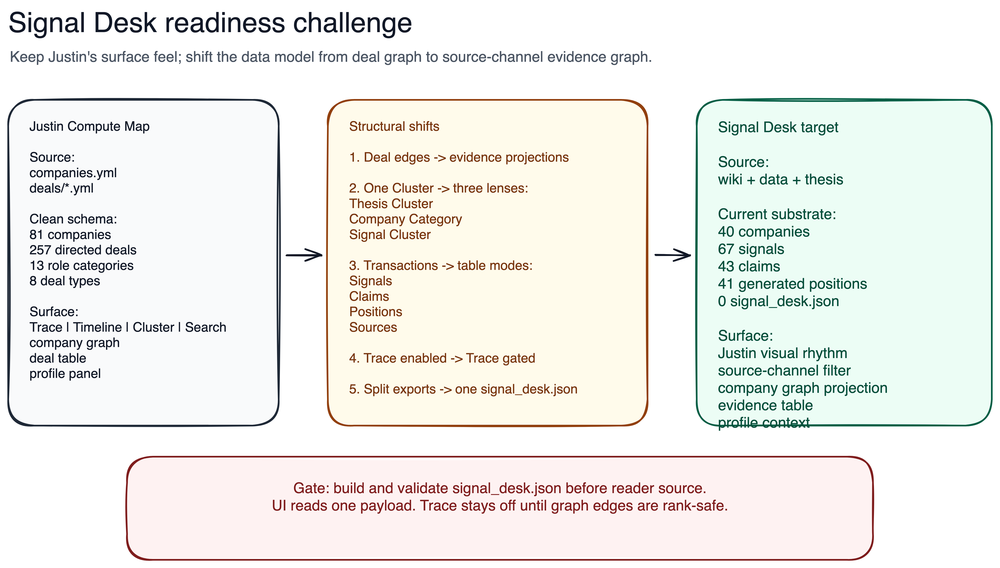

Last compared: 2026-04-19
Sources: compute-site (21 source files), compute-deal-map-data (81 companies, 257 deals), signal-desk final spec (09_final_spec.md), semi-stocks site-data (12 JSON artifacts)

# Compare: Justin Compute Map vs Signal Desk

## Visual Map



```text
Justin Compute Map                 Signal Desk
companies.yml                      canonical wiki + data + thesis
deals/*.yml                        split signals + claims + positions
schema validate                    site-data validate + signal_desk validate
directed deal graph                evidence graph projection
Trace enabled                      Trace disabled until rank-safe
```

## Philosophy

- **Justin Compute Map**: schema-first transaction map over directed compute deals and a ranked value chain.
- **Signal Desk**: canonical-propagation evidence reader over source channels, thesis clusters, company roles, and proof gates.

## Structure Map

| Layer | Justin Compute Map | Signal Desk |
|---|---|---|
| Source authority | `companies.yml`, `deals/*.yml` | `10-wiki`, `20-data`, `30-thesis`, `50-reports` |
| Generated payload | `dist/companies.json`, `dist/deals.json`, `dist/schema.json` | existing split `site-data/*.json`; locked new `signal_desk.json` |
| Primary node | company/entity | company/ticker |
| Primary edge | directed deal: `source -> target` | projected evidence relation, not raw provenance |
| Category | one company role enum | role category derived from mapping, separate from thesis cluster |
| Cluster control | company category cluster | thesis cluster + company category + source-channel signal cluster |
| Signal/source lens | not first-class | first-class `Signal Cluster`: Leopold, Baker, SemiAnalysis, earnings, thesis, proposals |
| Timeline | every deal has `date` and `date_display` | mixed exact dates, quarters, fiscal labels, verify windows |
| Trace | enabled with strict ranks and max tier jump | visible but disabled until edges are value-chain-safe |
| Table | deal table | evidence table: signals, claims, positions, sources |
| Profile panel | selected company or deal edge | selected company or evidence edge with source-channel context |
| Visual system | Inter, 12px, dark-mode, rectangular nodes, muted borders | copy same feel with attribution |
| Validation | AJV schema for company/deal source | Python validator plus schema entries for `signal_desk.json` |

## Key Divergences

1. **Edge semantics differ**: Justin edges are direct transactions; semi-stocks edges are evidence/provenance unless projected. Trace cannot copy directly.
2. **Cluster meaning differs**: Justin cluster is company role; Signal Desk needs three independent cluster lenses.
3. **Source provenance is richer in Signal Desk**: Baker/Leopold/SemiAnalysis are part of the product surface, not just links under rows.
4. **Timeline readiness differs**: Justin has uniform deal dates; Signal Desk needs date normalization before filtering.
5. **Data packaging differs**: Justin already ships one clean map dataset; Signal Desk still needs a unified reader payload.

## Shared DNA

- Both surfaces are dense graph-first readers, not dashboards.
- Both depend on stable company IDs, category roles, table rows, and profile panels.
- Both need strict validation before graph interactions can be trusted.

## Steal List

### Signal Desk should steal from Justin

- Toolbar/dropdown/mobile bottom-sheet mechanics from `Toolbar.jsx`, `Dropdown.jsx`, and `MobileFilterSheet.jsx`.
- Graph mechanics from `Graph.jsx` and `logic.js`: rank centroids, overlap removal, focus dimming, edge clipping, path grouping.
- Schema discipline from `compute-deal-map-data`: source validation before UI work.

### Signal Desk should not steal blindly

- Do not copy `Deal` naming; use evidence rows.
- Do not enable Trace from raw `edges.json`.
- Do not collapse source-channel filters into one generic `Cluster` until the three-lens toolbar is tested.

### Justin pattern could borrow from Signal Desk

- Source/channel provenance as a first-class filter.
- Proof-gate rows for forward claims, not only historical deals.
- Disabled-state gating for graph features when relationship certainty is lower than the UI implies.
